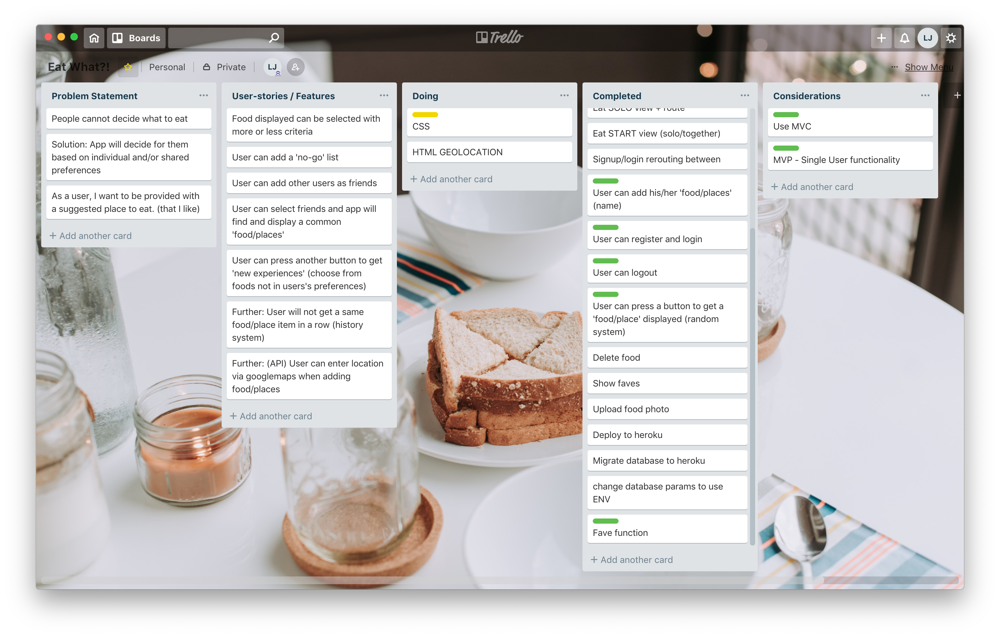
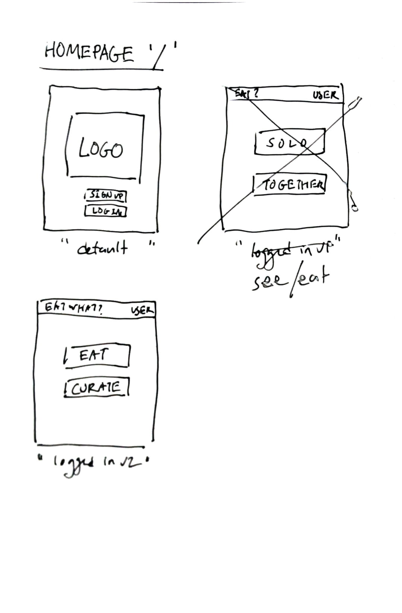
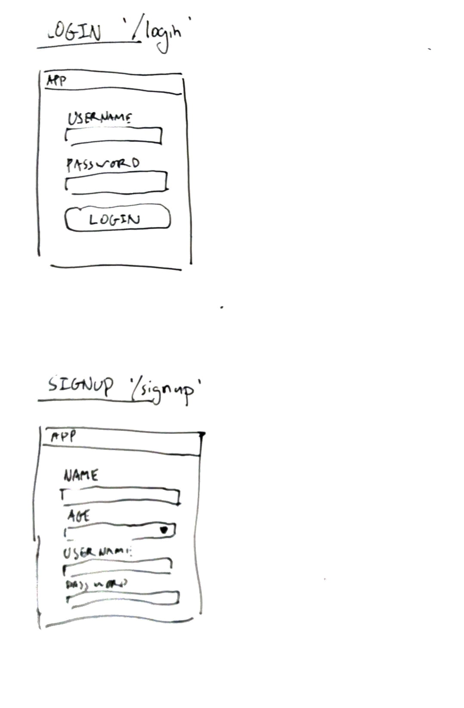
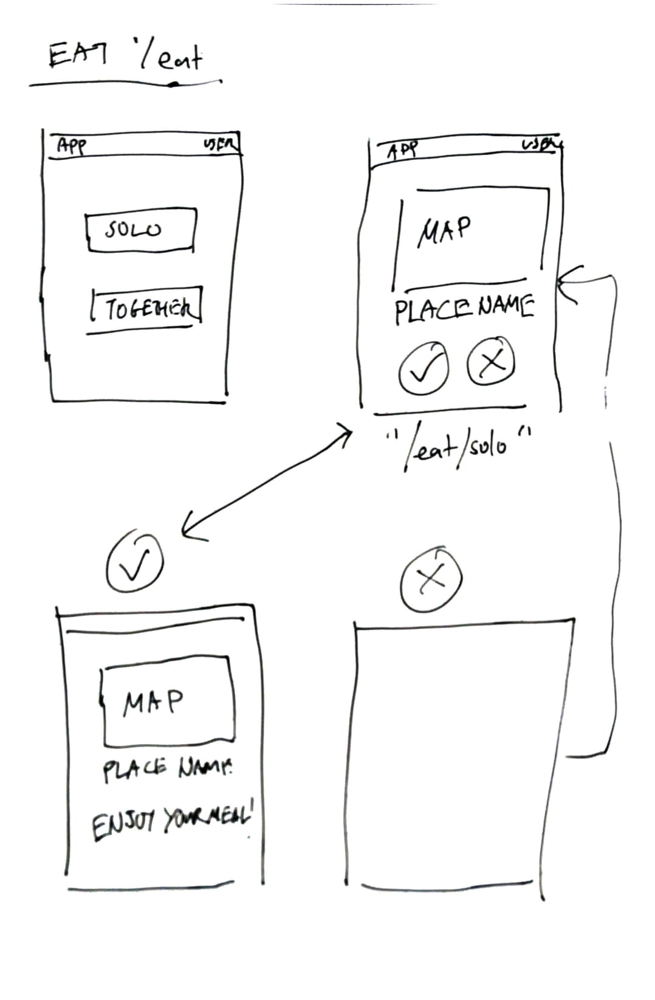

# EAT WHAT?

An attempt to answer the biggest question plaguing mankind.

## Getting Started

The following instructions should get the app up and running on local host.

### Prequisites
Node.js & NPM

`brew install node`

PostgreSQL

`brew install postgresql`

### Installation

Clone/fork the repository.

`git clone https://github.com/lamesensei/eat-what.git`

Install npm packages.

`npm install`

Initiate the PSQL db with the .sql files located within the directory. (_You maybe required to change the connection details in db.js_)
`psql -d eatwhatdb -f *.sql`

Initiate the app via node.

`node index.js`

## Built With

- [Express](https://nodejs.org/en/) - Main framework.
- [PSQL](https://postgresql.com) - Database.
- [React](https://reactjs.org) - View rendering.

## Review
See **postmortem.md** for more.

### Todo/Issues

1. Friends feature is not implemented.
2. Location feature is not completed and hard coded.
3. Error checking not fully implemented.
4. UI design can be improved.

### User Stories
How I planned my project.

### Wireframe
Basic wireframes from start of project

---

---

---

