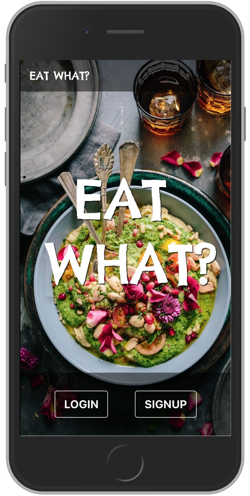

# EAT WHAT?



An attempt to answer the biggest question plaguing mankind.

## Features

- Designed for on the go mobile usage
- Store and list your favourite eating spots
- Never spend time deciding what to eat again

## Installation

Node.js & NPM

```
brew install node
```

PostgreSQL

```
brew install postgresql
```

Clone/fork the repository.

```
git clone https://github.com/lamesensei/eat-what.git
```

Install npm packages.

```
cd eat-what
npm install
```

Create the postgres database with the seed data provided. (_You maybe required to change the connection details in db.js_)

```
psql -d eatwhatdb -f *.sql
```

Initiate the app via node.

```
node index.js
```

## Technologies

- [Express](https://nodejs.org/en/) - Routing and rendering
- [PostgreSQL](https://postgresql.com) - Database
- [React](https://reactjs.org) - Front-end

## Review

See [postmortem.md](docs/postmortem.md) for more.

## Docs

See [docs folder](docs).
